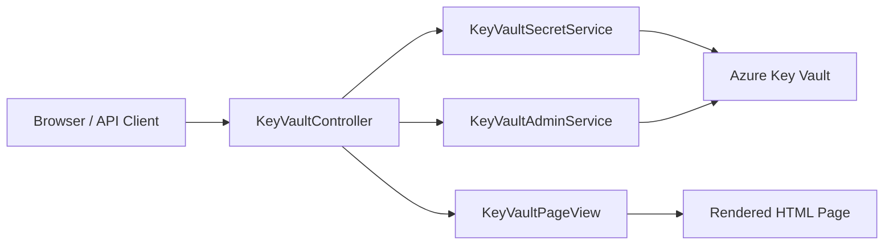
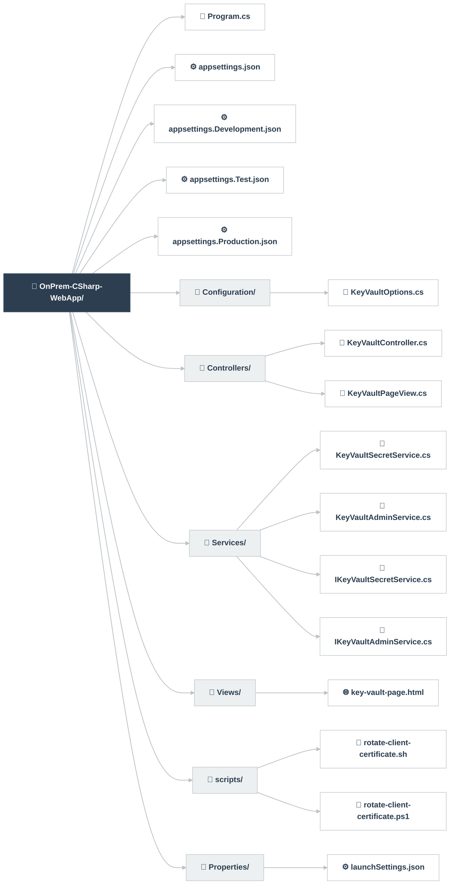

# Azure Key Vault On-Prem Demo

This repository contains a small .NET web application that demonstrates how an on-premises workload can securely consume secrets from Azure Key Vault without using shared secrets or embedded passwords.

The sample is intentionally practical and easy to follow. It shows how to:
- expose a simple browser-based UI for secret operations
- authenticate to Microsoft Entra ID with a PKI certificate
- read, list, and create secrets in Azure Key Vault
- apply Azure RBAC at the secret scope so each workload only receives access to the secrets it is meant to use

## What this application demonstrates
The app can:
- read a specific secret from Azure Key Vault
- list the secrets the current identity is permitted to access
- create a new secret and assign reader/writer access at the secret scope

This scenario is relevant when an on-premises host, service, or workload needs to retrieve secrets from Azure Key Vault in a controlled and auditable way.

## Security model
This sample is built around the following principles:
- shared client secrets are not used for Key Vault access
- authentication uses a certificate-backed workload identity
- access is scoped to specific secrets rather than granted broadly at the vault level
- different workloads, environments, and applications can be isolated by giving each identity only the permissions it needs

In practice, that means one service principal or workload identity per application or environment, with RBAC assignments applied only to the secrets it should access.

## Application structure
The application now follows a lightweight MVC-style separation:
- [OnPrem-CSharp-WebApp/Program.cs](OnPrem-CSharp-WebApp/Program.cs) wires up configuration and dependency injection
- [OnPrem-CSharp-WebApp/Controllers](OnPrem-CSharp-WebApp/Controllers) handles request and response flow
- [OnPrem-CSharp-WebApp/Views](OnPrem-CSharp-WebApp/Views) contains the HTML presentation layer
- [OnPrem-CSharp-WebApp/Services](OnPrem-CSharp-WebApp/Services) contains the business and Azure integration logic



## Azure Key Vault isolation architecture
The design isolates secrets by giving each workload identity access only to the secrets it needs, rather than granting broad vault-wide access.


This diagram illustrates the intent of the sample: each service account or workload identity is granted access only to the secret scope it requires, so secrets remain isolated across applications, environments, and workloads.

## Repository layout
```text
OnPrem-CSharp-WebApp/
├── Program.cs
├── appsettings.json
├── appsettings.Development.json
├── appsettings.Test.json
├── appsettings.Production.json
├── Configuration/
│   └── KeyVaultOptions.cs
├── Controllers/
│   ├── KeyVaultController.cs
│   └── KeyVaultPageView.cs
├── Services/
│   ├── KeyVaultSecretService.cs
│   ├── KeyVaultAdminService.cs
│   ├── IKeyVaultSecretService.cs
│   └── IKeyVaultAdminService.cs
├── Views/
│   └── key-vault-page.html
├── scripts/
│   ├── rotate-client-certificate.sh
│   └── rotate-client-certificate.ps1
└── Properties/
    └── launchSettings.json
```



## Prerequisites
- .NET 10 SDK
- an Azure subscription
- permission to create Azure resources and assign RBAC roles
- a Microsoft Entra tenant and the ability to create or configure application registrations / service principals
- one PKI certificate for the workload identity that will authenticate to Azure
- Azure CLI or the Azure portal for provisioning and role assignment

## Quick start
1. Build the application:
   ```bash
   dotnet build OnPrem-CSharp-WebApp/OnPrem-CSharp-WebApp.csproj
   ```
2. Run the application:
   ```bash
   dotnet run --project OnPrem-CSharp-WebApp/OnPrem-CSharp-WebApp.csproj
   ```
3. Open the UI in your browser:
   ```text
   https://localhost:7017/
   ```

The application also exposes these endpoints:
- POST /secrets/read
- POST /secrets/list-all
- POST /secrets/create

## Configuration
The application reads its settings from appsettings files and environment variables. The most important values are under the AzureKeyVault section:

```json
{
  "AzureKeyVault": {
    "VaultUri": "https://example-vault.vault.azure.net",
    "TenantId": "00000000-0000-0000-0000-000000000000",
    "ClientId": "11111111-1111-1111-1111-111111111111",
    "PemFilePath": "certs/private.pem",
    "PublicCertificateFilePath": "certs/public.crt",
    "UseWindowsCertificateStore": false,
    "CertificateThumbprint": "",
    "CertificateStoreLocation": "CurrentUser",
    "CertificateStoreName": "My",
    "SecretNames": [
      "MySecretName"
    ],
    "SubscriptionId": "22222222-2222-2222-2222-222222222222",
    "VaultResourceId": "/subscriptions/22222222-2222-2222-2222-222222222222/resourceGroups/rg-example/providers/Microsoft.KeyVault/vaults/example-vault"
  }
}
```

Set the secret names list to only the secrets this workload should be able to read. Keep this narrow to match the secret scope permissions that will be assigned.

## Azure setup guide
The goal is to create a Key Vault that can be used by on-premises applications while ensuring that each workload only has access to the secrets it should use.

### 1. Create the resource group and Azure Key Vault
Use Azure CLI to create the vault with Azure RBAC enabled:

```bash
az group create --name rg-onprem-kv-demo --location australiacentral

az keyvault create \
  --name <your-unique-vault-name> \
  --resource-group rg-onprem-kv-demo \
  --location australiacentral \
  --enable-rbac-authorization true
```

> Use a globally unique vault name. The sample is designed for Azure RBAC rather than legacy access policies.

### 2. Create or identify the workload identities
Create one Microsoft Entra application registration and service principal per workload, environment, or application.

For example:
- App A production reader identity
- App B integration reader identity
- App C writer identity

Each identity should be granted only the permissions it needs.

### 3. Create a certificate for the workload identity
Generate a private key and certificate for the workload identity on the on-premises host. The private key remains local; the public certificate is uploaded to the corresponding Entra application registration.

Example Linux command:

```bash
openssl req -x509 -newkey rsa:2048 -nodes \
  -days 14 \
  -subj "/CN=OnPremKeyVaultApp" \
  -keyout private.pem \
  -out public.crt
```

Then upload the public certificate to the Microsoft Entra application registration using the Azure portal or Azure CLI.

### 4. Create the secrets
You can create secrets in the vault with the CLI, the Azure portal, or through this sample application.

Example:

```bash
az keyvault secret set \
  --vault-name <your-unique-vault-name> \
  --name "app-a/prod/db-password" \
  --value "replace-with-a-real-value"
```

Create one secret per workload or environment as needed.

### 5. Assign RBAC roles at the secret scope
This is the key part of the design. Assign permissions to the secret resource, not to the entire vault, so one workload cannot read secrets that belong to another workload or environment.

Example for a reader identity:

```bash
VAULT_ID=$(az keyvault show --name <your-unique-vault-name> --resource-group rg-onprem-kv-demo --query id -o tsv)
SECRET_SCOPE="$VAULT_ID/secrets/app-a/prod/db-password"

az role assignment create \
  --assignee-object-id <reader-service-principal-object-id> \
  --role "Key Vault Secrets User" \
  --scope "$SECRET_SCOPE"
```

Example for a writer identity:

```bash
az role assignment create \
  --assignee-object-id <writer-service-principal-object-id> \
  --role "Key Vault Secrets Officer" \
  --scope "$SECRET_SCOPE"
```

Repeat this pattern for each secret and each workload. A workload that needs access to one secret should not receive access to other secrets unless that is explicitly required.

### 6. Configure the on-premises application
Populate the AzureKeyVault section in the app settings with:
- the vault URI
- the tenant ID
- the client ID for the workload identity
- the certificate path or Windows certificate store settings
- the secret names this workload is allowed to use
- the subscription ID and vault resource ID used by the create-secret workflow

### 7. Run the sample
Once configured, launch the app and use the UI or the HTTP endpoints to read or create secrets.

## How the sample uses Azure Key Vault
The application authenticates to Microsoft Entra ID using the configured certificate, then uses that identity to access Key Vault.

The create workflow is especially relevant for this pattern because it will:
- create a secret in the vault
- assign the reader role at the secret scope
- assign the writer role at the secret scope

That is how this sample illustrates the principle that access can be tightly restricted to specific service accounts and specific secrets.

## Recommended operating model
For production-like scenarios, prefer this model:
- one workload identity per application or environment
- one certificate per workload identity
- RBAC permissions granted only to the specific secrets required
- no broad vault-wide access unless there is a strong operational reason
- automated provisioning of certificates, service principals, and role assignments

## Helper scripts
- [OnPrem-CSharp-WebApp/scripts/rotate-client-certificate.sh](OnPrem-CSharp-WebApp/scripts/rotate-client-certificate.sh) creates or rotates a certificate on Linux.
- [OnPrem-CSharp-WebApp/scripts/rotate-client-certificate.ps1](OnPrem-CSharp-WebApp/scripts/rotate-client-certificate.ps1) creates or rotates a certificate on Windows.

## Troubleshooting
- If authentication fails, verify that the public certificate was uploaded to the correct Microsoft Entra application registration and that the private key matches.
- If a secret cannot be read, confirm that the workload identity has the Key Vault Secrets User role on that specific secret.
- If secret creation fails, confirm that the writer identity has the required role assignment and that the subscription and vault settings are correct.


==========
```bash
cd OnPrem-CSharp-WebApp
APP_ID=<app-registration-id> TENANT_ID=<tenant-id> ./scripts/rotate-client-certificate.sh
```

### Windows helper
The PowerShell script at [OnPrem-CSharp-WebApp/scripts/rotate-client-certificate.ps1](OnPrem-CSharp-WebApp/scripts/rotate-client-certificate.ps1) creates a new self-signed certificate in the Windows certificate store, exports backup files, optionally grants read access to the web application service account, and optionally uploads the new public certificate to the Microsoft Entra application registration.

```powershell
powershell -ExecutionPolicy Bypass -File .\scripts\rotate-client-certificate.ps1 -StoreLocation CurrentUser -ServiceAccount "NT SERVICE\W3SVC"
```

## How the runtime flow works
1. The application loads configuration from appsettings files and environment variables.
2. The service resolves the configured certificate source.
3. The certificate is loaded from a file or from the Windows certificate store.
4. A ClientCertificateCredential is created with the certificate.
5. The credential is used to authenticate to Microsoft Entra ID.
6. The resulting identity is used to read secrets from Azure Key Vault.
7. The application returns the retrieved secret values in JSON.

## Operational notes
- The private key remains on the on-premises machine and is not sent to Azure.
- The public certificate is uploaded to the application registration so Microsoft Entra ID can verify the identity.
- The application uses that identity to access Key Vault.
- File-based deployments can use PEM or PFX files.
- Windows store deployments can use the certificate thumbprint and the Windows-protected key store.

## Next steps
- Add deployment automation for certificate rotation
- Add environment-specific secret names and certificate thumbprints