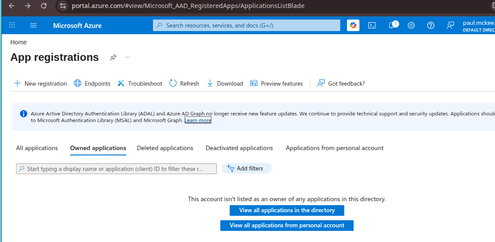
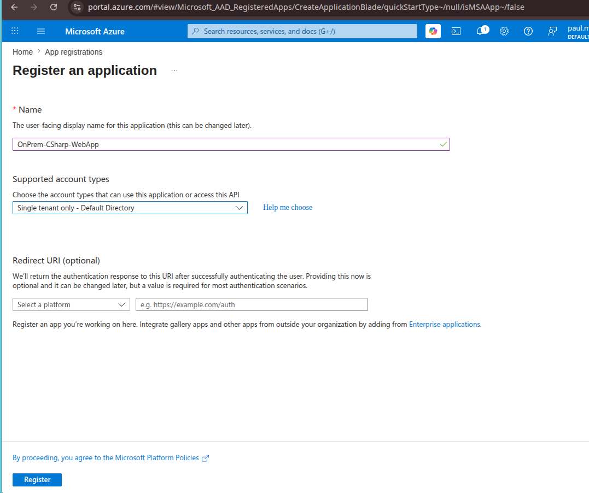
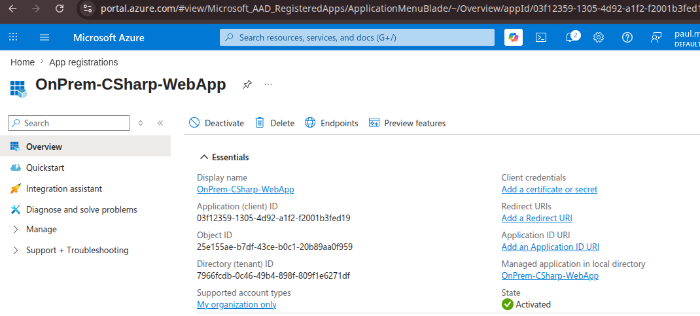

# OnPrem-CSharp-WebApp

Auth Options for Enterprise Application
1. use secrect for Auth
1. Use pki mTLS 
1. Use Azure Arc Identity - Only for Host, so not usfull when host shared with multiple application (NOT RECOMMEDED)
1. Use Azure Arc Identity for Proces Acoount/Identity (need more reasurch) 


Set up an on-premises C# web application to securely fetch secrets from Azure Key Vault, you cannot use Azure Managed Identities since your application runs outside of Azure.

Instead, authenticate using an Microsoft Entra ID App Registration (Service Principal). [1, 2, 3, 4] 


## 1. Register the Application in Azure Portal
The on-premises web server needs a cloud identity to log into Azure. [5] 

* Open the Azure Portal and navigate to Microsoft Entra ID.
* Select App registrations > New registration.
* Name the application (e.g., OnPrem-CSharp-WebApp) and click Register.
* Copy the Application (client) ID and Directory (tenant) ID from the overview page.
* Navigate to Certificates & secrets > New client secret.
* Copy the generated Secret Value immediately (it will be hidden later). [3, 6, 7, 8] 







## 2. Grant Key Vault Access
Your newly registered application needs permission to read secrets from your vault. [9] 

* Navigate to your Azure Key Vault. [10] 
* Go to Access configuration (depending on your vault model, this uses Azure RBAC or Access Policies). [10, 11] 
* If using Azure RBAC (Recommended): Go to Access Control (IAM) > Add role assignment, select the Key Vault Secrets User role, and assign it to your App Registration. [11, 12, 13, 14, 15] 
* If using Access Policies: Click Create / Add Access Policy, select Get and List from Secret Permissions, and select your App Registration as the principal. [3, 16] 

* Give anaother user the role access to add secrets
  - Navigate to IAM: Click Access control (IAM) in the left-hand menu of your Key Vault.
  - Add Assignment: Click + Add at the top, then select Add role assignment.
    - Select the Secret Officer Role: Search for and select the Key Vault Secrets Officer role.


    Choose Role: Select "Key Vault Secrets User" (this provides read-only access to values, which is ideal for apps). Click Next.Assign Members: Choose User, group, or service principal and click + Select members.

    
  Note: If you only need to read secrets without editing them, select Key Vault Secrets User instead.Assign Access: Click Next, choose User, group, or service principal, and click + Select members.Find Yourself: Search for your email (paul.mckee.aus@gmail.com), select it, and click Select.


## 3. Install NuGet Packages
Open your C# web application project (e.g., ASP.NET Core) and install the official Azure SDK packages: [17, 18, 19] 

```bash
dotnet new web -o OnPrem-CSharp-WebApp
cd OnPrem-CSharp-WebApp/

dotnet add package Azure.Identity
dotnet add package Azure.Security.KeyVault.Secrets
```

## 4. Configure Application Settings
Store your Azure credentials securely on your on-premises server. For local testing, add them to your appsettings.json: [17, 20, 21] 
```json
{
  "AzureKeyVault": {
    "VaultUri": "https://azure.net",
    "TenantId": "your-directory-tenant-id",
    "ClientId": "your-application-client-id",
    "ClientSecret": "your-client-secret-value"
  }
}
```

Will look like this:

```json
{
  "Logging": {
    "LogLevel": {
      "Default": "Information",
      "Microsoft.AspNetCore": "Warning"
    }
  },
  "AzureKeyVault": {
    "VaultUri": "https://azure.net",
    "TenantId": "your-directory-tenant-id",
    "ClientId": "your-application-client-id",
    "ClientSecret": "your-client-secret-value"
  },

  "AllowedHosts": "*"
}
```

(Note: For on-premises production deployments, consider loading these four values from environment variables instead of hardcoding them in the file). [22] 
## 5. Add C# Implementation
Initialize the SecretClient using ClientSecretCredential to fetch your secrets programmatically: [17, 23] 

```C#

using Azure.Identity;using 
Azure.Security.KeyVault.Secrets;

var builder = WebApplication.CreateBuilder(args);

// Load settings from appsettings.json
var kvSettings = builder.Configuration.GetSection("AzureKeyVault");
string vaultUri = kvSettings["VaultUri"];
string tenantId = kvSettings["TenantId"];
string clientId = kvSettings["ClientId"];
string clientSecret = kvSettings["ClientSecret"];

// Authenticate using the Service Principal
var credential = new ClientSecretCredential(tenantId, clientId, clientSecret);

// Instantiate the Secret Client
var secretClient = new SecretClient(new Uri(vaultUri), credential);

// Example: Retrieve a specific secret explicitly

KeyVaultSecret secret = await secretClient.GetSecretAsync("MySecretName");
string secretValue = secret.Value;
var app = builder.Build();
app.MapGet("/", () => $"Retrieved secret value: {secretValue}");
app.Run();
```
 
# Use Pem Certificate and NO Secrets in configs

To eliminate client secret strings entirely,  authenticate the  on-premises application using an Asymmetric X.509 Certificate.
When using this method, the application uses a private key (stored locally) to sign a JWT token, and Microsoft Entra ID verifies it using the public key stored in the cloud.

## 1. Generate a Self-Signed Certificate
If you do not have a certificate from an internal or public Certificate Authority, generate a self-signed one via OpenSSL. 
Ensure both the .crt (public key) and a .pem or .pfx (private key) files are exported. 

# Generate a private key and a public certificate valid for 2 years
```shell
openssl req -x509 -newkey rsa:4096 -keyout private.pem -out public.crt -days 7 -nodes -subj "/CN=OnPremKeyVaultApp"


========
openssl req -x509 -newkey rsa:2048 -nodes \
  -keyout private.pem \
  -out public.crt \
  -days 365 \
  -subj "/CN=OnPremKeyVaultApp"

# creates:
#    private.pem: the private key
#    public.crt: the public certificate

# Verify the files were created
ls -l private.pem public.crt

# Confirm the key and certificate match
openssl x509 -in public.crt -noout -modulus | openssl md5
openssl rsa -in private.pem -noout -modulus | openssl md5

# The two hashes should be the same.

# Place the files where the app can find them
# The app is currently configured to look for a file named private.pem in the runtime directory, so a simple approach is:
cp private.pem ~/repos/azure-secret-on-prem/OnPrem-CSharp-WebApp/bin/Debug/net8.0/private.pem
cp public.crt ~/repos/azure-secret-on-prem/OnPrem-CSharp-WebApp/bin/Debug/net8.0/public.crt

#=====================
# Or use PKCS#12 format
#======================

openssl req -x509 -newkey rsa:2048 -nodes \
  -keyout private.pem \
  -out public.crt \
  -days 365 \
  -subj "/CN=OnPremKeyVaultApp"

openssl pkcs12 -export \
  -out certificate.pfx \
  -inkey private.pem \
  -in public.crt \
  -passout pass:changeit

#  this creates:
#    private.pem: private key
#    public.crt: public certificate
#    certificate.pfx: PKCS#12 bundle containing both

# Copy it into the app output folder if needed:
cp certificate.pfx ~/repos/azure-secret-on-prem/OnPrem-CSharp-WebApp/bin/Debug/net8.0/certificate.pfx

```
## 2. Upload the Public Key to Azure
Microsoft Entra ID needs the public part of your certificate to verify your application's identity. [7] 

* Go to the Azure Portal > Microsoft Entra ID > App registrations.
* Select your existing application (OnPrem-CSharp-WebApp).
* Click Certificates & secrets > Certificates > Upload certificate.
* Select the public.crt file and click Add.
* Copy the Thumbprint value generated by Azure. [8, 9, 10, 11, 12] 

## 3. Securely Store the PEM File On-Premises
Place your private.pem file in a secure directory on your local server. [13] 

* Crucial: Restrict file system permissions so only the exact user identity running your web application pool (e.g., IIS_IUSRS or a specific service account) can read this file.

## 4. Update Application Configuration
Remove the ClientSecret completely from your config. Update your appsettings.json to reference the file path of your private certificate:
```json
{
  "AzureKeyVault": {
    "VaultUri": "https://azure.net",
    "TenantId": "your-directory-tenant-id",
    "ClientId": "your-application-client-id",
    "PemFilePath": "C:\\ProgramData\\YourApp\\private.pem"
  }
}
```

## 5. Update C# Implementation
Replace ClientSecretCredential with ClientCertificateCredential. The Azure SDK natively handles loading private keys directly from PEM files via the ClientCertificateCredentialOptions.
```C#
using Azure.Identity;using Azure.Security.KeyVault.Secrets;
var builder = WebApplication.CreateBuilder(args);
var kvSettings = builder.Configuration.GetSection("AzureKeyVault");
string vaultUri = kvSettings["VaultUri"];
string tenantId = kvSettings["TenantId"];
string clientId = kvSettings["ClientId"];
string pemFilePath = kvSettings["PemFilePath"];

// Create credential using the on-premises PEM file path
var credential = new ClientCertificateCredential(
    tenantId, 
    clientId, 
    pemFilePath
);

// Initialize SecretClient using the certificate credential
var secretClient = new SecretClient(new Uri(vaultUri), credential);

// Fetch secret securely
KeyVaultSecret secret = await secretClient.GetSecretAsync("MySecretName");string secretValue = secret.Value;
var app = builder.Build();
app.MapGet("/", () => $"Authenticated with Certificate. Secret value: {secretValue}");
app.Run();
```
## 6. Delete the Old Client Secret
Now that your code successfully compiles and connects via certificate:

* Return to Microsoft Entra ID > App registrations > Certificates & secrets.

## Certificate flow in plain English
This sample uses a certificate-based identity because the app runs on-premises and cannot rely on Azure-managed identity.

The flow is:
1. The app reads a private key from a PEM file on disk.
2. The app also reads the matching public certificate so it can build a usable X.509 client certificate object.
3. That certificate is presented to Microsoft Entra ID as the application identity.
4. If Entra ID accepts the certificate, Azure Key Vault allows the app to read the requested secret.

In other words:
- the private key stays on the on-premises machine and is never sent to Azure
- the public certificate is uploaded to the app registration so Entra ID can verify the identity
- the app then uses that identity to access Key Vault

For this example, the app expects the following settings in configuration:
- AzureKeyVault:VaultUri
- AzureKeyVault:TenantId
- AzureKeyVault:ClientId
- AzureKeyVault:PemFilePath
- AzureKeyVault:PublicCertificateFilePath
- AzureKeyVault:SecretName

If you prefer a simpler deployment model, you can replace the separate PEM files with a single PFX/P12 file and point PemFilePath at it.
* Under Client secrets, click the Trash icon (Delete) next to the old string secret to revoke it. [14] 

If you are interested, I can show you how to load this certificate from the Windows Certificate Store instead of a file path, or help you configure automatic key rotation for this certificate. Which step would you like to explore next?  
