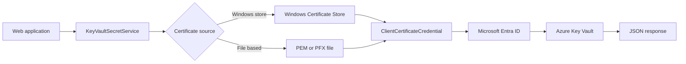

# OnPrem-CSharp-WebApp

## Quick start
- Build the sample app: dotnet build OnPrem-CSharp-WebApp/OnPrem-CSharp-WebApp.csproj
- Run the sample app: dotnet run --project OnPrem-CSharp-WebApp/OnPrem-CSharp-WebApp.csproj
- Ensure the local machine has the .NET 10 SDK installed before building or running the sample
- Configure Azure Key Vault settings in the appsettings files or environment variables
- Choose a certificate source:
  - file-based mode for Linux or cross-platform deployments
  - Windows certificate store mode for Windows deployments by setting UseWindowsCertificateStore to true and supplying a certificate thumbprint
- Retrieve secrets from Azure Key Vault through the JSON endpoint exposed by the app

## Purpose
This repository exists as a reference implementation for on-premises applications that need to read secrets from Azure Key Vault without storing client secrets in local configuration files. Existing applications often keep secrets and passwords in configuration files or environment variables; this sample demonstrates a safer model based on certificate-based authentication and the Microsoft Entra application identity.

## Contents and layout
The documentation is structured in layers so that a developer can move from high-level concepts to implementation details quickly.

1. Purpose and scope
2. Repository structure and component responsibilities
3. High-level design and runtime flow
4. Setup and configuration steps
5. Certificate lifecycle automation
6. Windows-specific certificate store guidance

## Repository structure
```text
OnPrem-CSharp-WebApp/
├── Program.cs
├── appsettings.json
├── appsettings.Development.json
├── appsettings.Test.json
├── appsettings.Production.json
├── Configuration/
│   └── KeyVaultOptions.cs
├── Services/
│   └── KeyVaultSecretService.cs
├── scripts/
│   ├── rotate-client-certificate.sh
│   └── rotate-client-certificate.ps1
└── Properties/
    └── launchSettings.json
```

- [Program.cs](OnPrem-CSharp-WebApp/Program.cs) - application startup, configuration loading, and HTTP endpoint registration
- [KeyVaultSecretService.cs](OnPrem-CSharp-WebApp/Services/KeyVaultSecretService.cs) - certificate loading and Key Vault secret retrieval
- [KeyVaultOptions.cs](OnPrem-CSharp-WebApp/Configuration/KeyVaultOptions.cs) - strongly typed settings for Key Vault and certificate selection
- [appsettings.json](OnPrem-CSharp-WebApp/appsettings.json) - default configuration values
- [rotate-client-certificate.sh](OnPrem-CSharp-WebApp/scripts/rotate-client-certificate.sh) - Linux certificate rotation helper
- [rotate-client-certificate.ps1](OnPrem-CSharp-WebApp/scripts/rotate-client-certificate.ps1) - Windows certificate rotation helper

## High-level design
The solution follows a simple flow:



The core concepts are:
- On-premises application needs a workload identity for Azure
- A certificate is used as the credential instead of a client secret
- The public certificate is uploaded to the Microsoft Entra application registration
- The private key remains on the on-premises host and is protected by the operating system
- The application reads the requested secrets from Azure Key Vault through a service principal identity backed by the certificate

## Prerequisites
- .NET 10 SDK
- An Azure subscription
- An Azure Key Vault instance
- A Microsoft Entra application registration
- Access to the Azure portal or Azure CLI
- OpenSSL for Linux certificate generation
- PowerShell for Windows certificate management

## Implementation details
### 1. Register an application in Microsoft Entra ID
- Open the Azure portal.
- Navigate to Microsoft Entra ID.
- Open App registrations.
- Create a new registration for the on-premises application.
- Record the Application (client) ID and Directory (tenant) ID.


### 2. Grant Key Vault access
- Open the target Key Vault.
- Assign the ***Key Vault Secrets User*** role or create an access policy that grants Get and List secret permissions to the application registration.
- The application registration becomes the identity used by the web application when it connects to Key Vault.
- Two Accounts/Roles suld be used, both should be Azure Registered Applications:
  - **Key Vault Secrets Officer**:  Manages secret creation and deletion. Used by the automated deployment account for Continuous Deployment (CD).
  - **Key Vault Secrets User**: Reads secrets. Used by application accounts.  Application should not modify the secrets.


#### Add the Secret


### 3. Upload the public certificate
- Generate or rotate a certificate.
- Upload the public certificate file to the Microsoft Entra application registration under Certificates.
- Record the certificate thumbprint for later use in Windows certificate store scenarios.


### 4. Configure the application
The application expects the following settings under the AzureKeyVault section:

```json
{
  "AzureKeyVault": {
    "VaultUri": "https://example-vault.vault.azure.net",
    "TenantId": "00000000-0000-0000-0000-000000000000",
    "ClientId": "11111111-1111-1111-1111-111111111111",
    "PemFilePath": "certs/private.pem",
    "PublicCertificateFilePath": "certs/public.crt",
    "UseWindowsCertificateStore": false,
    "CertificateThumbprint": "",
    "CertificateStoreLocation": "CurrentUser",
    "CertificateStoreName": "My",
    "SecretNames": [
      "MySecretName"
    ]
  }
}
```

### 5. Build and run the sample
```bash
dotnet build OnPrem-CSharp-WebApp/OnPrem-CSharp-WebApp.csproj
dotnet run --project OnPrem-CSharp-WebApp/OnPrem-CSharp-WebApp.csproj
```

The root endpoint returns a JSON payload containing the retrieved secret values.

## Linux certificate flow
### Generate a self-signed certificate
```bash
openssl req -x509 -newkey rsa:2048 -nodes \
  -days 365 \
  -subj "/CN=OnPremKeyVaultApp" \
  -keyout private.pem \
  -out public.crt
```

### Optional PKCS#12 bundle
```bash
openssl pkcs12 -export \
  -out certificate.pfx \
  -inkey private.pem \
  -in public.crt \
  -passout pass:changeit
```

### Store the files for the application
The repository now uses a certs folder for the sample configuration. The service resolves the configured certificate path relative to the application content root and runtime base directory.

## Windows certificate store flow
Windows deployments can load the certificate directly from the Windows certificate store by thumbprint. This model is suitable for services that run under a dedicated service account and need the private key to remain protected by the Windows store.

### Example configuration
```json
{
  "AzureKeyVault": {
    "VaultUri": "https://example-vault.vault.azure.net",
    "TenantId": "00000000-0000-0000-0000-000000000000",
    "ClientId": "11111111-1111-1111-1111-111111111111",
    "UseWindowsCertificateStore": true,
    "CertificateThumbprint": "AA11BB22CC33DD44EE55FF66778899A0B1C2D3E",
    "CertificateStoreLocation": "CurrentUser",
    "CertificateStoreName": "My",
    "SecretNames": [
      "MySecretName"
    ]
  }
}
```

### Example code for loading from the Windows certificate store
```csharp
using System.Security.Cryptography.X509Certificates;
using Azure.Identity;
using Azure.Security.KeyVault.Secrets;

var thumbprint = builder.Configuration["AzureKeyVault:CertificateThumbprint"];
var storeName = builder.Configuration["AzureKeyVault:CertificateStoreName"] ?? "My";
var storeLocation = Enum.Parse<StoreLocation>(builder.Configuration["AzureKeyVault:CertificateStoreLocation"] ?? "CurrentUser", true);

using var store = new X509Store(storeName, storeLocation);
store.Open(OpenFlags.ReadOnly);

var matches = store.Certificates.Find(X509FindType.FindByThumbprint, thumbprint, validOnly: false);
var certificate = matches.OfType<X509Certificate2>().FirstOrDefault();

if (certificate is null)
{
    throw new InvalidOperationException("Certificate was not found in the Windows certificate store.");
}

var credential = new ClientCertificateCredential(tenantId, clientId, certificate);
var secretClient = new SecretClient(new Uri(vaultUri), credential);
```

### Windows service account permissions
The service account that runs the web application should receive read access to the private key container. The PowerShell helper script grants that access automatically when a service account name is provided.

## Certificate rotation helpers
### Linux helper
The shell script at [OnPrem-CSharp-WebApp/scripts/rotate-client-certificate.sh](OnPrem-CSharp-WebApp/scripts/rotate-client-certificate.sh) creates a new certificate, stores the new material in the certs folder, archives the previous files, and optionally uploads the public certificate to the Microsoft Entra application registration.

```bash
cd OnPrem-CSharp-WebApp
APP_ID=<app-registration-id> TENANT_ID=<tenant-id> ./scripts/rotate-client-certificate.sh
```

### Windows helper
The PowerShell script at [OnPrem-CSharp-WebApp/scripts/rotate-client-certificate.ps1](OnPrem-CSharp-WebApp/scripts/rotate-client-certificate.ps1) creates a new self-signed certificate in the Windows certificate store, exports backup files, optionally grants read access to the web application service account, and optionally uploads the new public certificate to the Microsoft Entra application registration.

```powershell
powershell -ExecutionPolicy Bypass -File .\scripts\rotate-client-certificate.ps1 -StoreLocation CurrentUser -ServiceAccount "NT SERVICE\W3SVC"
```

## How the runtime flow works
1. The application loads configuration from appsettings files and environment variables.
2. The service resolves the configured certificate source.
3. The certificate is loaded from a file or from the Windows certificate store.
4. A ClientCertificateCredential is created with the certificate.
5. The credential is used to authenticate to Microsoft Entra ID.
6. The resulting identity is used to read secrets from Azure Key Vault.
7. The application returns the retrieved secret values in JSON.

## Operational notes
- The private key remains on the on-premises machine and is not sent to Azure.
- The public certificate is uploaded to the application registration so Microsoft Entra ID can verify the identity.
- The application uses that identity to access Key Vault.
- File-based deployments can use PEM or PFX files.
- Windows store deployments can use the certificate thumbprint and the Windows-protected key store.

## Next steps
- Add deployment automation for certificate rotation
- Add environment-specific secret names and certificate thumbprints
- Integrate the pattern into existing on-premises services that currently store secrets in local configuration files
